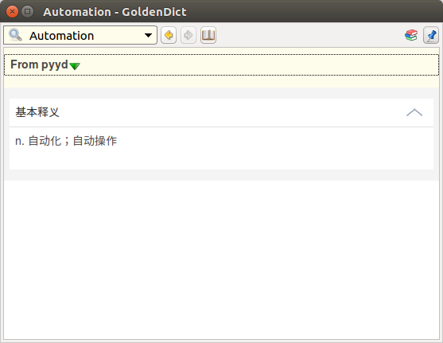

# goldendict-pretty

Make pretty format for goldendict scan popup.

Original:


Pretty:



# Install

```bash
git clone https://github.com/shdxiang/goldendict-pretty.git
sudo pip install lxml
```

# Setting

From main menu, go to _Edit->Dictionaries->Sources->Programs_, and add a program dictionary.

`Type`: _Html_

`Command Line`: _python /home/shdxiang/works/goldendict-pretty/src/m.youdao.com.py %GDWORD%_ (**Chage to your path**)

Like this:


